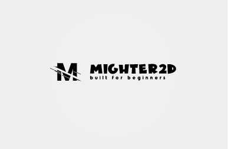

<p align="center">
    
</p>

# Mighter2d

Mighter2d is a scene-based game engine written in C++ for developing simple 2D games. It continues the development of 
my previous project, [Infinite Motion Engine (IME)](https://github.com/KwenaMashamaite/IME) which was also designed for
2D game development. While Mighter2d features the same scene-based approach and feature set as IME, it completely removes
support for rigid body physics. Mighter2d also provides a range of improvements and enhancements over IME, making it a more 
simpler and user-friendly game engine.

Mighter2d is built on top of the [SFML](https://www.sfml-dev.org/index.php) library for graphics rendering and the [TGUI](https://tgui.eu/) library for user interface components.

## Features

* **Graphics** - Render Window, 2D grid, Animatable Sprites, 2D camera, Spritesheet, etc...
* **GUI** - Label, Button, Checkbox, MenuBar, and much more
* **Animations** - 2D animations which support both spritesheet and texture atlas
* **Physics** - Path finding, Grid based movement, Grid cell based collisions
* **Input** - Keyboard, Mouse and Joystick support
* **Audio** - Built-in audio support for music and Sound effects
* **Event system** - Thread safe event system
* **Asset management** - Automated resource management system
* **Scene management** - Last In First Out (LIFO) scene management
* **Time** - Schedule one time, repeating or indefinite callbacks

*Mighter2d does not support an Editor*

## Demos (games developed with Mighter2d)

* [Super Pac-Man arcade game clone](https://github.com/KwenaMashamaite/SuperPacMan)

## Downloads

The latest official precompiled Mighter2d binaries can be downloaded [here](https://github.com/KwenaMashamaite/Mighter2d/releases/tag/v1.0.0).
To use the library you must have a supported C++17 compliant compiler (GCC or VC++).
If you want to use a different version, you'll have to [build](#Build) the library yourself.

## Installation

1. Using CMake

If you extracted Mighter2d to a location known to *CMAKE*, you don't have to
set `MIGHTER2D_DIR`, *CMake* will automatically find the library

```cmake
# Find Mighter2d
set(MIGHTER2D_DIR "path_to_Mighter2d_root_directory_here/lib/cmake/Mighter2d") # Skip if Mighter2d installed in known location
find_package(mighter2d 1.0.0 REQUIRED)

# Link Mighter2d
target_link_libraries(your_executable_name PRIVATE mighter2d)

# Example

set(MIGHTER2D_DIR "C:/users/kwena/desktop/Mighter2d-1.0.0/lib/cmake/Mighter2d") # Skip if Mighter2d installed in known location
find_package(mighter2d 1.0.0 REQUIRED)

target_link_libraries(Pacman PRIVATE mighter2d)

```
<br>

<em>Note:</em>

After successfully building your game executable, copy the contents of `Mighter2d/bin` folder to the
folder in which your game executable resides. If your current `BUILD_TYPE` is **Debug**, then copy
the contents of `Mighter2d/bin/Debug` and if it's **Release**, then copy the contents of `Mighter2d/bin/Release`.
You must also copy the contents of `Mighter2d/bin/Runtime` regardless of the build type.

##  Build

If you want to use *Mighter2d* with a different compiler, then you must build it yourself:

1. Clone the repository
2. Download and Install [CMake 3.17+](https://cmake.org/)
3. Download and install *IME*'s dependencies: [SFML 2.5.1](https://www.sfml-dev.org/index.php), [TGUI 0.9.3](https://tgui.eu/) <br>
   The dependencies must have a matching compiler and architecture (e.g, If you intend to build *IME* with <br>
   `GCC MinGW 11.2.0 (32-bit)`, then *SFML* and *TGUI* binaries must all be compiled with `GCC MinGW 11.2.0 (32-bit)`
   <br>

4. Run the following commands from the project root directory:

```shell
mkdir build
cd build
cmake ..
cmake --build .
```

## Learn

* [Tutorials](#) (Coming soon)
* [Doxygen documentation](#) (Coming soon)

## Platform

Mighter2d only supports the Windows operating system 

## License

Mighter2d is released under the [MIT](https://opensource.org/licenses/MIT) license. See [LICENSE](LICENSE) file.
